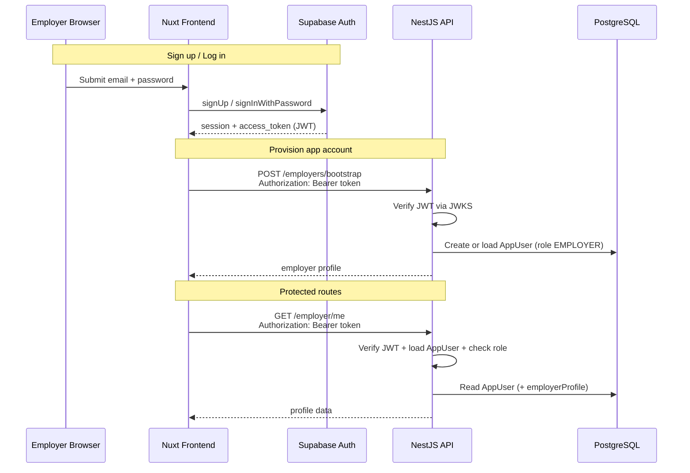
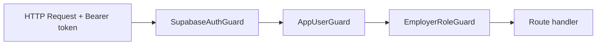

# Employer Authentication — MVP (Slice 1)

## Purpose

This document describes how employer authentication works in the MVP job listing platform.

It covers sign-up, login, session handling, API protection, and how Supabase Auth connects to application users in PostgreSQL.

See also: [02-database-design.md](./02-database-design.md), [03-api-contract.md](./03-api-contract.md), [04-user-flows.md](./04-user-flows.md).

---

## 1. Overview

The platform uses a **split auth model**:

| Layer | Responsibility |
|-------|----------------|
| **Supabase Auth** | Email/password, sessions, access tokens (JWT) |
| **Nuxt (frontend)** | Login UI, session storage, sending Bearer tokens to the API |
| **NestJS (backend)** | JWT verification, `AppUser` provisioning, role checks, business data |
| **PostgreSQL (Prisma)** | `AppUser` records, roles, employer profiles |

**Important rules:**

- Job seekers do **not** need accounts in the MVP.
- Passwords go **only** to Supabase — never to NestJS.
- The frontend **never** uses `SUPABASE_SERVICE_ROLE_KEY`.
- **Authorization** (who is an employer) is decided by `AppUser.role` in Postgres, not by Supabase metadata.

Correct flow:

```txt
Nuxt frontend → Supabase Auth (login/session)
Nuxt frontend → NestJS API (business actions) → Prisma → PostgreSQL
```

---

## 2. Architecture



---

## 3. Two identities per employer

Every logged-in employer has **two linked identities**:

| Identity | Where it lives | Key field |
|----------|----------------|-----------|
| **Supabase Auth user** | Supabase `auth.users` | UUID (`sub` in JWT) |
| **App user** | Postgres `app_users` | `supabaseAuthUserId` → JWT `sub` |

`AppUser` fields (Prisma):

- `id` — application user id (cuid)
- `supabaseAuthUserId` — links to Supabase Auth user id
- `email` — unique
- `role` — `EMPLOYER` or `ADMIN`

Supabase proves *who* signed in. NestJS decides *what they can do* via `AppUser.role`.

---

## 4. Sign-up flow

**Route:** `/employers/signup`

1. User enters contact name, email, password.
2. Nuxt calls `supabase.auth.signUp()` with:
   - email + password
   - `user_metadata.contact_name` (stored in Supabase until company profile exists — Slice 2)
3. **If Supabase returns a session** (email confirmation off in dev):
   - Nuxt calls `POST /employers/bootstrap` with `Authorization: Bearer <access_token>`
   - NestJS creates `AppUser` with `role = EMPLOYER` (if not already present)
   - User is redirected to `/employer/dashboard`
4. **If no session** (email confirmation on):
   - User sees a “confirm your email” message
   - After confirming and logging in, bootstrap runs on first API access

**Password never touches NestJS.**

---

## 5. Login flow

**Route:** `/employers/login`

1. User enters email + password.
2. Nuxt calls `supabase.auth.signInWithPassword()`.
3. On success, session is stored in the browser (Supabase client).
4. Nuxt calls `ensureEmployerProfile()`:
   - Tries `GET /employer/me`
   - If **404** (no `AppUser` yet) → calls `POST /employers/bootstrap` → returns profile
5. Redirect to `/employer/dashboard` (or `?redirect=` target).

---

## 6. Logout flow

1. User clicks “Log out”.
2. Nuxt calls `supabase.auth.signOut()`.
3. Local session state is cleared.
4. User is sent to `/employers`.
5. No NestJS logout endpoint is required.

---

## 7. Protecting employer pages (frontend)

**Middleware:** `apps/web/app/middleware/employer.ts`

Applied to routes under `/employer/**` (e.g. dashboard).

1. Load Supabase session (`getSession()`).
2. If no session → redirect to `/employers/login?redirect=<original path>`.

This only checks **Supabase session** — not NestJS. It keeps unauthenticated users off employer UI.

**Layout:** `apps/web/app/layouts/employer.vue` — employer header, nav, sign-out.

---

## 8. API authentication (backend)

### 8.1 JWT verification (JWKS)

**File:** `apps/api/src/auth/supabase-jwt.service.ts`

Modern Supabase projects sign access tokens with **ES256** (asymmetric). The API verifies them using the project JWKS endpoint:

```txt
https://<project-ref>.supabase.co/auth/v1/.well-known/jwks.json
```

**Required env:** `SUPABASE_URL` in `apps/api/.env`

The legacy `SUPABASE_JWT_SECRET` (HS256) is **not** used for verification in the current implementation.

### 8.2 Guard stack

Guards run in order on protected routes:

| Guard | Purpose | Used on |
|-------|---------|---------|
| **SupabaseAuthGuard** | Read `Authorization: Bearer`, verify JWT, set `request.supabaseUser` | Bootstrap, `/employer/me` |
| **AppUserGuard** | Load `AppUser` by `supabaseAuthUserId` | `/employer/me` only |
| **EmployerRoleGuard** | Ensure `AppUser.role === EMPLOYER` | `/employer/me` only |



**Bootstrap** (`POST /employers/bootstrap`) uses only **SupabaseAuthGuard**, because `AppUser` may not exist yet.

**`/employer/me`** uses all three guards.

---

## 9. API endpoints (employer auth)

| Method | Path | Guards | Purpose |
|--------|------|--------|---------|
| `POST` | `/employers/bootstrap` | SupabaseAuthGuard | Create or return `AppUser` with `EMPLOYER` role |
| `GET` | `/employer/me` | All three | Return current employer profile |

### Bootstrap behavior (`POST /employers/bootstrap`)

1. Verify JWT → read `sub` and `email`.
2. If `AppUser` exists for `sub` → return it (idempotent).
3. If email already used by another account → **409 Conflict**.
4. Otherwise create `AppUser` with `role = EMPLOYER`.

Role is **always** set by the backend — never from client metadata.

### Me response shape

```json
{
  "id": "app-user-id",
  "email": "employer@example.com",
  "role": "EMPLOYER",
  "hasCompanyProfile": false
}
```

`hasCompanyProfile` is `true` only when an `EmployerProfile` row exists (Slice 2).

---

## 10. How the frontend calls the API

**File:** `apps/web/app/composables/useEmployerApi.ts`

1. `getAccessToken()` from `useAuth()` → `session.access_token`.
2. Every employer API call adds:

```txt
Authorization: Bearer <access_token>
```

3. `ensureEmployerProfile()` handles first-time provisioning:
   - `GET /employer/me` → on 404 → `POST /employers/bootstrap`

Public routes (jobs, applications) do **not** send a Bearer token.

---

## 11. Contact name (Option B)

Contact name from sign-up is stored in **Supabase `user_metadata.contact_name`**, not in Postgres yet.

- Set at sign-up via `signUp({ options: { data: { contact_name } } })`.
- Shown on the dashboard from `user.user_metadata`.
- Will move to `EmployerProfile` when company profile is built (Slice 2).

NestJS does **not** read or trust metadata for authorization.

---

## 12. Environment variables

### Frontend (`apps/web/.env`)

```env
NUXT_PUBLIC_SUPABASE_URL=https://<project>.supabase.co
NUXT_PUBLIC_SUPABASE_ANON_KEY=<publishable/anon key>
NUXT_PUBLIC_API_BASE_URL=http://localhost:4000
```

### Backend (`apps/api/.env`)

```env
SUPABASE_URL=https://<project>.supabase.co
SUPABASE_SERVICE_ROLE_KEY=<backend only — storage, not auth>
DATABASE_URL=...
DIRECT_URL=...
```

| Variable | Where | Purpose |
|----------|-------|---------|
| `NUXT_PUBLIC_SUPABASE_ANON_KEY` | Web only | Supabase client (login/signup) |
| `SUPABASE_URL` | API | JWKS URL for JWT verification |
| `SUPABASE_SERVICE_ROLE_KEY` | API only | Resume storage — never in browser |

---

## 13. Error responses (common cases)

| Status | When | User-facing meaning |
|--------|------|---------------------|
| **401** | Missing/invalid/expired token | Log in again |
| **404** | Valid token but no `AppUser` | Bootstrap runs automatically on login |
| **403** | `AppUser` exists but not `EMPLOYER` | Wrong account type |
| **409** | Email already linked to another auth user | Use different email or log in |

Supabase-side errors (e.g. wrong password, email not confirmed) are returned by Supabase before any NestJS call.

---

## 14. Key source files

### Backend

| Path | Purpose |
|------|---------|
| `apps/api/src/auth/supabase-jwt.service.ts` | JWKS JWT verification |
| `apps/api/src/auth/guards/supabase-auth.guard.ts` | Attach verified JWT claims |
| `apps/api/src/auth/guards/app-user.guard.ts` | Load `AppUser` from database |
| `apps/api/src/auth/guards/employer-role.guard.ts` | Enforce `EMPLOYER` role |
| `apps/api/src/employers/employers.controller.ts` | `POST /employers/bootstrap` |
| `apps/api/src/employers/employer-me.controller.ts` | `GET /employer/me` |
| `apps/api/src/employers/employers.service.ts` | Bootstrap and profile logic |

### Frontend

| Path | Purpose |
|------|---------|
| `apps/web/app/plugins/supabase.client.ts` | Supabase browser client |
| `apps/web/app/composables/useAuth.ts` | Sign-up, login, logout, session |
| `apps/web/app/composables/useEmployerApi.ts` | Authenticated API calls |
| `apps/web/app/middleware/employer.ts` | Protect `/employer/**` routes |
| `apps/web/app/pages/employers/signup.vue` | Employer sign-up |
| `apps/web/app/pages/employers/login.vue` | Employer login |
| `apps/web/app/pages/employer/dashboard.vue` | Protected dashboard |

---

## 15. Security principles

1. **Never expose service role key** to the frontend.
2. **Never trust `user_metadata`** for roles or permissions.
3. **Roles live in Postgres** (`AppUser.role`), set only by NestJS bootstrap or seed.
4. **JWT verification** uses Supabase JWKS (public keys), not shared secrets in the browser.
5. **Bootstrap is idempotent** — safe to retry; does not change role on existing users.
6. **Employer routes** scope data by `AppUser` / `EmployerProfile`, not client-supplied IDs.

